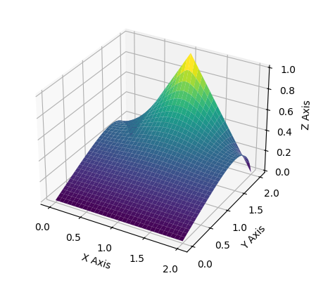

# finite-diferences-fceia
Finite elements code that solves an _initial value problem_ and graphs the function solution in 3D.
It's a rework on Python of the original project that I coded in MatLab which outputs a coordinates which can be graph through LaTeX. Here, you can modify the step length and the function is fixed to the one that was given to me to solve. Unfortunately, it's tailored to the unique _IVP_ shown in image, it needs to be updated to solve any _IVP_.

